 

**English** &nbsp;·&nbsp; [한국어](README_ko.md)

 

## About

I'm an AI Engineer based in Seoul, Republic of Korea.

I build **LLM-powered automation** — systems where language models do real work rather than demos. I started out frontend-focused and grew into full-stack, and these days most of my time goes to agent tooling: MCP servers, LLM SDKs, and workflow automation that runs unattended.

Before Buchigo I led engineering as **CTO at StageNote** and founded **HYOM as CEO**, so I've built teams and companies as well as products.

 

## Experience

| Role | Organization | Period |
| :--- | :--- | :--- |
| **AI Engineer** | [Buchigo](https://github.com/buchigo) | Jul 2025 – Present |
| **CTO** | [StageNote](https://github.com/StageNote-Team) | Aug 2024 – Oct 2025 |
| **CEO** | [HYOM](https://github.com/ampcompany) | Mar 2021 – Dec 2022 |

 

## Award

> ### 🏆 IBM Call for Code — APEC 1st Place
> **IBM** · August 2021

Built **Charong** with team AppSense: a location-based app that surfaces restaurants and retailers offering packaging and delivery in **reusable containers** — making sustainable consumption the default choice rather than an effort.

 

## Education

| Degree | Institution | Period |
| :--- | :--- | :--- |
| **A.S. in Artificial Intelligence** | Gyeonggi University of Science and Technology | Mar 2022 – Dec 2025 |

 

## Tech Stack

#### AI & Automation

#### Languages

#### Frontend

#### Backend & Infrastructure

 

## Projects

### [Graph-Knowledge-AI (gkai)](https://github.com/kmbm0916-biz/Graph-Knowledge-AI)

Records **every execution event** from a Claude Code agent into a local graph database, makes it observable through a web visualizer, and feeds it back via MCP tools so the agent can reuse its own past context. Ships 6 hooks, 12 MCP recall tools, a KuzuDB projection layer, and cross-platform installers with daemon autostart.

### [Map_search](https://github.com/kmbm0916-biz/Map_search)

Pathfinding algorithms rendered into an interactive web visualizer, so the search behaviour is something you can watch rather than infer.

 

## Languages

| Language | Proficiency |
| :--- | :--- |
| **Korean** | Native |
| **Japanese** | Conversational |
| **English** | Basic conversational |

 

## Connect

 

## GitHub Stats

<!-- Rendered by .github/workflows/grs.yml and committed as static SVGs. -->

  
  

